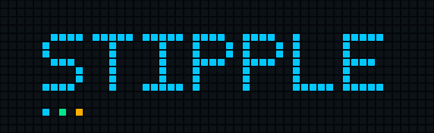

<p align="center">
  
</p>

<p align="center"><strong>Open pixel firmware for the Ulanzi TC002.</strong></p>

Stipple replaces the stock application on the Ulanzi TC002 with a renderer it
owns end to end: a 52×16 framebuffer, declarative custom apps, Berry scripts,
notifications, an HTTP and MQTT API, sound, and a browser emulator.
Local-first — no cloud, no account, no vendor app.

**[galadril.github.io/Stipple](https://galadril.github.io/Stipple/)** — the
site, with animated previews of the built-in apps, a
[library of scripts](https://galadril.github.io/Stipple/shop/) and the
[API reference](https://galadril.github.io/Stipple/api/), which is generated
from a specification CI checks against the router. Every preview is real
output from the test suite. To run the emulator yourself, see
[Try it without a device](#try-it-without-a-device).

> **Status: pre-release. It runs on real hardware.**
>
> Stipple installs into the device's `res` partition beside a small shim that
> chooses what to run. A Stipple that will not load falls back to the stock
> Ulanzi clock rather than to nothing, so the device stays reachable and
> recovery is deleting one file. After the first install, updates are a file
> upload in the web UI — no flashing, no USB stick.
>
> The panel, the scripts, the speaker, the microphone and the carousel have
> been run on a TC002, with the capability probes checked against the device
> rather than inferred from the host build.
>
> Two things still have not been done. The **firmware-update endpoint has not
> been exercised end to end** — it validates, installs atomically and keeps
> the previous version for rollback, and no device has yet been updated
> through it. And **`https` does not work on a TC002**: the TLS support is
> there and verifies properly, but the device's own OpenSSL has every TLS
> protocol version compiled out, so scripts get a clear `openssl has no tls`
> instead of a connection. Plain `http` on your own network is fine. See the
> changelog.
>
> See [docs/install.md](docs/install.md).

> ### ⚠️ Use entirely at your own risk
>
> **This modifies firmware on a device the manufacturer did not intend to be
> modified.** It can leave your clock unusable, and recovery may need a USB
> stick, hardware access, or help from the vendor.
>
> That is not theoretical. This project bricked its own development device
> badly enough to need a recovery procedure obtained from Ulanzi support. The
> procedure is written down in [docs/recovery.md](docs/recovery.md) *because*
> that happened.
>
> Stipple comes with **no warranty and no liability of any kind** — GPL-3.0
> sections 15 and 16. **Do not install it on a device you are not prepared to
> lose.**

---

## What it does

**The panel.** 52×16 RGB through the vendor HAL, dirty rendering, a frame
budget, overlays and configurable transitions.

**Apps and scenes.** A declarative scene model — pixel, line, rectangle, text,
icon, bitmap, sprite, progress, graph, animation, group — with a carousel you
can reorder, pin and configure per app. Built-in clock, stopwatch, battery and
microphone visualiser.

**Scripts.** Berry scripts that draw, play sound, hear the room, talk MQTT and
fetch over HTTP, each compiled and run by the test suite before it is
published. The [script library](https://galadril.github.io/Stipple/shop/) is
the `scripts/` directory; a script can also take the controls for games. See
[docs/scripting.md](docs/scripting.md).

**Controls.**
−/+ to adjust, middle to go back, hold the knob for settings. One control
never means two things.

**Networking, all its own.** The TC002 has no DHCP client and does not load
its own Wi-Fi driver — the stock application does both. Stipple replaces that
application, so it loads the driver, starts the supplicant, holds a DHCP
lease, and sets the clock over SNTP. It scans and joins networks, and hosts a
`Stipple-setup` access point on `192.168.4.1` when it cannot reach yours.

**One API surface.** `/api/v1/*`, served by the device and reachable over HTTP
or MQTT — the same router answers both, so they cannot drift. The
configuration page is compiled into the binary, because a device whose storage
has failed is exactly when its configuration page is needed.

**Access control.** HTTP Basic over the page and the API alike, off by
default, with a physical way back: hold − and + for five seconds.

**A browser emulator.** The real renderer compiled to WebAssembly, serving the
real configuration page through the real router. Not a mock.

Over a thousand tests, including golden-image comparison of rendered frames.

## Try it without a device

```powershell
.\dev.ps1 doctor     # check your toolchain
.\dev.ps1 test       # run the host test suite
.\dev.ps1 preview    # render frames to PNG - needs only a compiler
.\dev.ps1 serve      # build the emulator, open http://localhost:8080/
```

`serve` needs the Emscripten SDK; see
[`docs/development/toolchain.md`](docs/development/toolchain.md).

## Install it on a device

Read [docs/install.md](docs/install.md) — it is short, and every warning in it
is something that actually went wrong.

The shape of it: **capture your own device's partition, build an image from
it, flash once from a USB stick.** There is no image to download, because one
would contain Ulanzi's firmware. The part that is ours, `libstipple.so`, ships
with every release.

Before that, you can run Stipple from `/tmp` without touching flash at all —
a power cycle restores the stock firmware every time:

```powershell
.\dev.ps1 capture 192.168.1.238:5555   # read a restore image off your device first
.\dev.ps1 deploy  192.168.1.238:5555   # cross-build, push to /tmp, run
```

`capture` comes first for a reason: **every TC002 ships a recovery image on
its own USB volume, and it is not necessarily the firmware that unit is
running.** On the development unit, holding reset installs an *older* image.
Capture from your own device and that button becomes correct.

## What is not done

Stated plainly, because a status section that only lists wins is not one.

- **Updating through the web UI is implemented but unproven.** The endpoint
  validates, installs atomically and keeps the previous version for rollback,
  and it has not yet been exercised end to end on hardware.
- **No update checking.**
  The device also has no working DNS — see the findings document — so anything
  that fetches by hostname needs that solved first.
- **DHCP lease renewal is untested end to end.** The timing is tested on a
  host and the wire format against a real server; twelve hours apart, they
  have not yet met.
- **Icons have a store but no library.** Upload, budget and rendering all
  work; nothing ships with it, and there is no picker in the web UI.
- **One device, one firmware revision.** Everything measured here comes from a
  single unit. Hardware revisions are an open question.

## How it is built

```
                        STIPPLE CORE
┌─────────────────────────────────────────────────────────┐
│ Apps / Notifications / Scheduler / API / MQTT           │
│                         ↓                               │
│ Scene Model → Layout → Renderer → Framebuffer           │
└─────────────────────────┬───────────────────────────────┘
                   IPlatformServices
             ┌────────────┴────────────┐
      TC002 adapter               Simulator adapter
```

Everything above that line is portable C++17 and host-testable. Only the
adapter below it needs a device, and the simulator runs the *same* scene
parser, layout engine, font engine and app scheduler as the hardware.

That boundary is why the simulator was built first and bring-up came last,
and it paid off: when hardware arrived, every layer above it already worked
and had tests, so bring-up meant writing one adapter rather than debugging a
whole system through a 52×16 window.

**No external dependencies**, by decision. The JSON parser, PNG encoder, test
harness and MQTT client are all in-tree.

## Repository layout

```
firmware/      core renderer, platform adapters, host tests   (C++17)
scripts/       the Berry script library, one file per script
simulator/     browser emulator (Emscripten)
site/          the website, generated from the repository
tooling/       device probe, cross-toolchains, image tooling, site builders  (Python)
docs/          guides, reference, hardware research
```

The device configuration page lives in `firmware/web/` and is compiled into
the binary.

## Documentation

| | |
|---|---|
| [galadril.github.io/Stipple](https://galadril.github.io/Stipple/) | The site, the emulator and the API reference |
| [docs/install.md](docs/install.md) | Getting Stipple onto a device |
| [docs/recovery.md](docs/recovery.md) | Getting a device back |
| [docs/api.md](docs/api.md) | The `/api/v1` surface |
| [docs/mqtt.md](docs/mqtt.md) | The MQTT surface |
| [docs/scripting.md](docs/scripting.md) | Writing Berry scripts, and what they can reach |
| [docs/DESIGN.md](docs/DESIGN.md) | What the thing should feel like |
| [docs/research/tc002-platform-findings.md](docs/research/tc002-platform-findings.md) | What the hardware actually does, measured |
| [THIRD_PARTY_NOTICES.md](THIRD_PARTY_NOTICES.md) | What Stipple uses, what it owes, and to whom |
| [docs/bring-up.md](docs/bring-up.md) | Day one with a new device |

## Contributing

See [CONTRIBUTING.md](CONTRIBUTING.md).

House rules:

- Reliability before feature count. A feature that works every time beats five
  that half-work.
- **No AWTRIX source copying.** Stipple is an independent implementation.
- All hardware behind interfaces; the simulator must stay supported.
- No unbounded allocations or queues; nothing allocates in the render path.
- Tests required for core behaviour.
- Document reverse-engineered platform behaviour in `docs/`.

## Warranty, liability and risk

**There is none. You carry all of it.**

Stipple is licensed GPL-3.0-or-later, whose sections 15 and 16 say this in
legal terms. In plain ones:

- **No warranty.** Provided "as is". Nobody promises it works, is fit for any
  purpose, or will not damage your device.
- **No liability.** No contributor is responsible for a bricked clock, lost
  configuration, a voided manufacturer warranty, time spent on recovery, or
  any other loss.
- **No support obligation.** Issues are welcome and answered when someone has
  time. Nothing is owed to anyone.
- **Installing this will probably void your manufacturer warranty.**

This is a hobby project that modifies consumer hardware by methods the
manufacturer did not document or intend. It has damaged a device before and it
can damage yours. **Decide on the assumption that the device might not survive
it.**

Nothing here is legal advice, and a disclaimer does not override rights you may
have under local consumer law.

## Licence

[GPL-3.0-or-later](LICENSE). See [THIRD_PARTY_NOTICES.md](THIRD_PARTY_NOTICES.md) for the dependency
register.

Restore images and partition captures are **not** redistributable — they are
Ulanzi's firmware and specific to one unit. They are gitignored for both
reasons.

---

Stipple is an independent open-source project, not affiliated with or endorsed
by Ulanzi or AWTRIX. Ulanzi, U-Clock and other product names are trademarks of
their respective owners.
